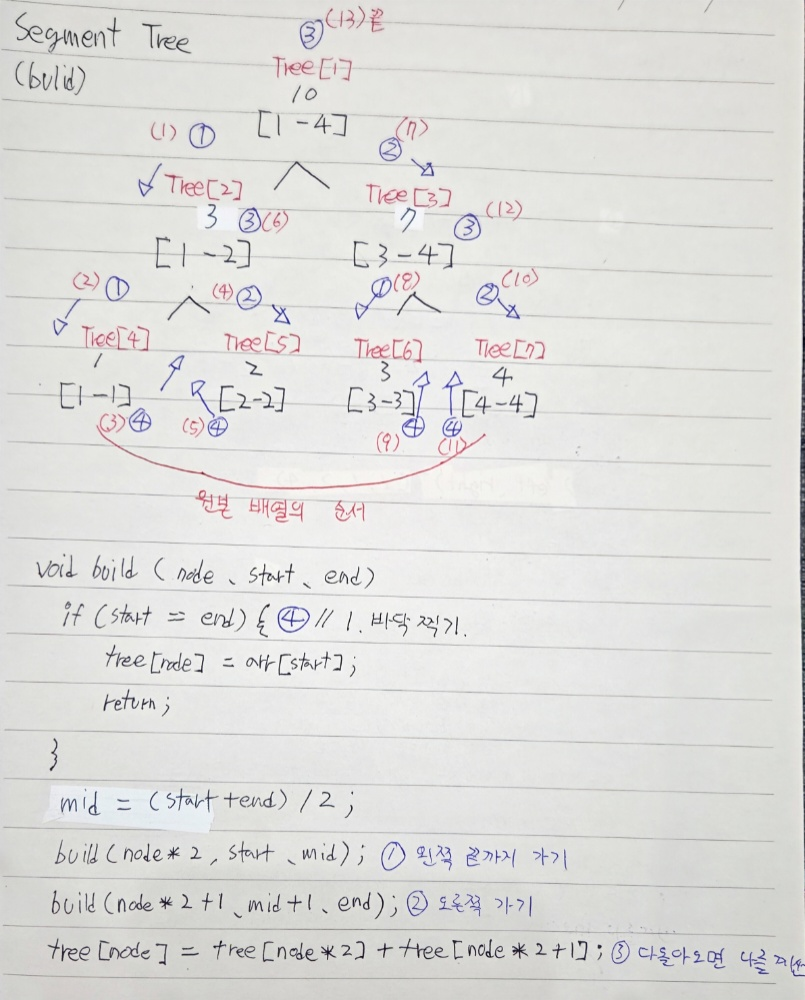
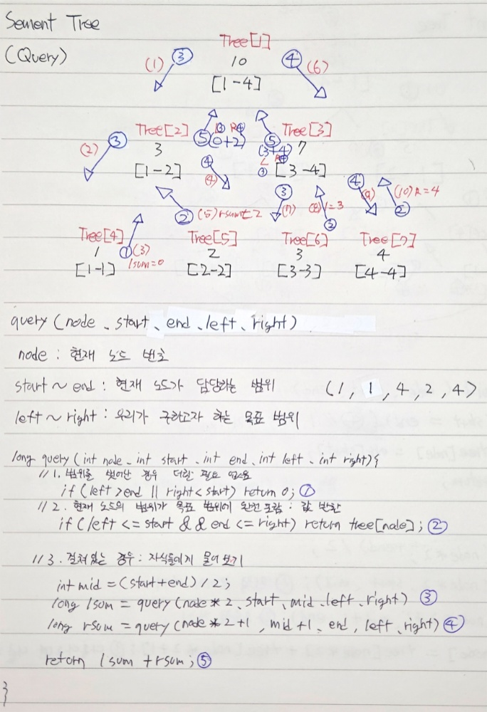
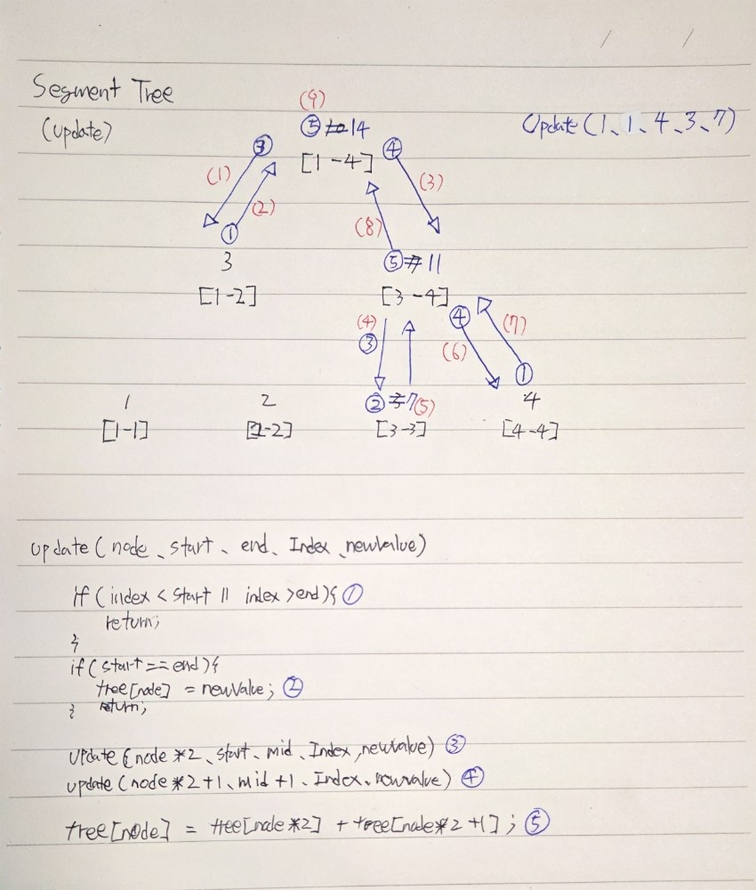

# 🌲 11659번: 구간 합 구하기 4 (Segment Tree 활용)

## 1. 문제 개요
* **핵심 목표**: 수 $N$개가 주어질 때, 특정 구간 $[i, j]$의 합을 빠르게 구하기.
* **사용 알고리즘**: 세그먼트 트리 (Segment Tree).
* **기술적 근거**: 단순 반복문은 $O(N)$이지만, 세그먼트 트리는 $O(\log N)$의 효율성을 가짐. 데이터의 변경이 잦은 환경까지 고려한다면 가장 확장성 있는 대안임.

---

## 2. 알고리즘 설계 (My Logic)

### 🏗️ 데이터 구조 및 Build (생성)

* **Tree Array**: $N$의 4배 크기로 할당하여 완전 이진 트리 구조를 수용.
* **Recursive Logic**: 재귀를 이용해 구간을 절반씩 쪼개며 바닥(Leaf Node)부터 루트까지 합을 채워나감.

### ⚙️ 핵심 프로세스: Query (조회)

1. **범위 밖**: `left > end || right < start`인 경우 `0` 반환.
2. **범위 안**: 현재 노드가 담당하는 구간이 찾는 범위에 완전히 포함되면 `tree[node]` 반환.
3. **걸친 범위**: 자식 노드들에게 탐색을 위임한 후 결과를 합산하여 반환.

### 🛠️ 확장 로직: Update (갱신)

* 이번 문제에는 사용되지 않았으나, 값이 변경될 경우 해당 인덱스를 포함하는 부모 노드들만 $O(\log N)$으로 갱신하는 로직 정리 완료.

---

## 3. 핵심 인사이트 & 시행착오 (Trouble Shooting)

### ✅ 재귀의 흐름과 인덱스 관리
* `node * 2`와 `node * 2 + 1`을 통해 이진 트리를 배열로 관리하는 방식이 Heap 자료구조와 유사함을 체감함.
* 인덱스 범위가 `1-based`인지 `0-based`인지에 따라 `start`, `end` 관리에 주의가 필요함.

### ✅ 분할 정복의 위력
* 전체를 다 뒤지는 대신, 이미 계산된 "구간의 합" 노드들만 선택적으로 조합하여 결과를 내는 과정에서 로그 스케일($O(\log N)$)의 효율성을 이해함.

---

## 4. 회고
> **"배열을 트리로 바라보는 새로운 관점"**
>
> 유니온 파인드에 이어 세그먼트 트리까지 정복하며 데이터 구조의 중요성을 다시금 느꼈다. 단순히 합을 구하는 것을 넘어, 트리 구조를 통해 데이터의 '수정'과 '조회' 사이의 균형을 맞추는 엔지니어링적 사고를 연습할 수 있었다.
>
> 직접 손으로 그려본 재귀의 흐름이 코드의 한 줄 한 줄과 매칭될 때의 쾌감이 컸다. 플랫폼이 닫히긴 했지만 남은 9~10단계도 이 기세로 밀어붙여 로드맵을 완성하겠다.